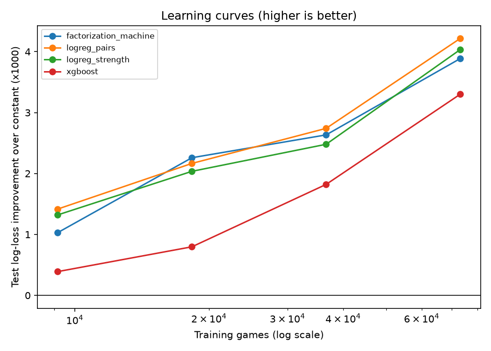

# LoL Draft Win Probability: Project Overview

*Last updated: 2026-10-08. Branch: `data-collector`.*

This document explains the whole project from scratch: what it is for, where the data comes from, how each model works, what we have learned so far, and what is still missing. You do not need to know League of Legends or machine learning to follow it; the technical details are there for those who want them.

---

## 1. What we are building

**League of Legends** is a 5-versus-5 online game. Before each ranked game, the two teams take turns picking **champions** (playable characters) in a phase called **champion select** or the **draft**. There are about 170 champions, and each player plays one of five **roles** (positions).

**The goal:** a tool that, during champion select, shows a player how each champion they could pick changes their team's chance of winning. For example, if you pick last for the red team, you enter the other 9 champions and get a ranked list like:

```
1. Zoe        win chance 48.8%   (+2.8 points vs. a typical option)
2. Annie      win chance 48.1%   (+2.1)
...
40. Ryze      win chance 41.5%   (-4.5)
```

Because the tool **ranks options**, what matters most is the *difference* between candidates, not the exact percentage.

---

## 2. Terms used in this document

| Term | Meaning |
|---|---|
| Champion | One of ~170 playable characters. |
| Role | The five positions: **top**, **jungle (jg)**, **mid**, **bot / ADC (adc)**, **support (sup)**. |
| Blue / red side | The two teams. Blue picks first. In our data blue wins about 49% of games. |
| Draft | The 10 champions picked (plus bans) before a game. |
| Patch | A balance update (e.g. 16.19, 16.20), roughly every two weeks. Champion strength changes between patches. |
| Diamond+ | The top ranks of the ladder: Diamond, Master, Grandmaster, Challenger. |
| Riot API | Riot Games' official web API that returns ranked ladders and match data. |
| PUUID | Riot's permanent anonymous ID for a player. |
| Off-role pick | A champion played in an unusual role (e.g. Xerath as bot laner). |
| One-trick | A player who almost only plays one champion and is unusually good at it. |

**How we score predictions** (all measured on games the model never saw):

| Metric | Plain-language meaning | Good value |
|---|---|---|
| **Log loss** | The main score. Penalises confident wrong predictions heavily. Always guessing 50% gives 0.693. | Lower is better; even 0.688 vs 0.693 is a real difference here. |
| **Improvement vs. constant** | How much lower the log loss is than a model that always predicts the blue-side average. Our headline number. | Above 0, with a confidence interval that excludes 0. |
| **AUC** | Take one game blue won and one blue lost: the chance the model gave the won game the higher blue-win probability. 0.5 = coin flip. | Higher is better. |
| **Accuracy** | How often "the team with >50% wins" is right. | Higher is better, but crude for small effects. |
| **Calibration / ECE** | Do games predicted at 55% really end up 55% wins? ECE is the average gap. | Close to 0. |
| **Bootstrap 95% CI** | We resample the test games 2,000 times to see how much a difference could be due to luck. | An interval that does not include 0 = a real difference. |

---

## 3. The story so far (why the project looks the way it does)

1. **First version.** A transformer model (see §6.7) used the 10 champions **plus each player's ranked win rate** for the season. It reached about **63% accuracy**, which looked great.
2. **The leak.** The player win rates were downloaded *after* the games were played, so they already included the result of the very game being predicted. A player with 20 games who won the game in question has a visibly higher win rate *because of that win*. A one-line rule ("the team with the higher total win rate wins") already scored 62.4%, and it worked best exactly where the leak is strongest (players with few games: 65.9%). This is called **target leakage**: the model was reading the answer, not predicting it.
3. **Draft-only restart.** We dropped all player features and asked the honest question: how much can the *draft alone* tell us? Answer: a small but real amount, about **53.5% accuracy / AUC 0.55**. That is normal for solo-queue games, where player skill and in-game play dominate.
4. **The tool depends on that small signal.** When ranking which champion *you* should pick, everything about the players stays the same between candidates, so only the draft part of the model can tell candidates apart.
5. **New data pipeline.** The old dataset is 110k games from patches 16.1-16.6 (early 2026), which is too few games to learn matchups and too old for today's balance. A new collector (§4.2) downloads draft data continuously.

---

## 4. Data

### 4.1 The original dataset (`data/processed/`)

- 110,000 ranked solo/duo games from NA, EUW, KR and OCE, collected with `scripts/build_draft_dataset.py`.
- Patches 16.1-16.6 (plus ~330 older games that we drop).
- Each row: the 10 champions by side and role, which side won, and (leaky) player win-rate columns.
- `scripts/clean_draft_dataset.py` produced the "cleaned" version used by the old models, with hand-made champion labels (tank, mage, ...) from `src/champion_labels.py`.

### 4.2 The new collector (`scripts/collect_drafts.py`)

**What it collects:** every ranked solo/duo game played by Diamond+ players since a start date, from 13 servers.

**How it works:**

```
                 once a day, per server (13 threads)
  Riot ranked ladder  ───────────────────────────────▶  roster table
  (Diamond I-IV, Master+)                               (~700k Diamond+ players)
                                                             │
                 continuously, per routing region (4 threads)│ most active players first
                                                             ▼
  Riot match list for a player  ──▶  new match IDs  ──▶  Riot match details  ──▶  matches table
  (only games since --since)        (skip ones we have)    (1 call per game)      (SQLite, saved immediately)
```

- **Rate limits.** A development API key allows about 100 requests per 2 minutes *per routing region*. Match data is routed through 4 regions (AMERICAS, EUROPE, ASIA, SEA), so the collector runs one thread per region and paces itself using the limits Riot reports in its response headers. Measured throughput: about **2,900 games per region per hour**, i.e. up to ~70k per region per day (**~250-280k per day** in total, minus any hours spent waiting for a new key). The log prints the rate every 5 minutes.
- **Which servers.** AMERICAS: NA1, BR1, LA1, LA2. EUROPE: EUW1, EUN1, TR1. ASIA: KR, JP1. SEA: OC1, SG2, TW2, VN2. Servers in the same region share its rate limit, so extra servers add *supply* (more Diamond+ games), not speed.
- **Crawl order.** Players with the most games this season are crawled first; players whose last check found no new games are re-checked every 48 hours instead of every 6.
- **Resumable.** Every game is written to `data/collector/drafts.sqlite` as soon as it arrives. Stopping (Ctrl+C) and restarting loses nothing.
- **Key expiry.** Development keys expire every 24 hours. When that happens, the collector **pauses** and checks `.env` every 30 seconds; paste in a new key and it resumes by itself. A fresh key can take a moment to activate, so if Riot rejects it at first, the collector tries it again every minute until it works.

**What is stored per game:** match ID, server, region, start time, exact game version and patch, duration, the 10 champions (names and IDs) by side and role, which side won, both teams' bans, the 10 player IDs (for future player features), and `n_diamond_plus`, the number of the 10 players who are on our Diamond+ roster. Remakes and games with broken role data are skipped and recorded in a `skipped` table.

**Daily routine:**
1. Generate a new development key at developer.riotgames.com.
2. Replace the line in `.env`: `RIOT_API_KEY=RGAPI-...` (in the project root; `.env` is git-ignored).
3. That's it; a running collector picks it up within 30 seconds.

**Commands** (from the project root, using the virtual environment's Python):

```
.venv\Scripts\python -m scripts.collect_drafts collect            # run until Ctrl+C
.venv\Scripts\python -m scripts.collect_drafts status             # what has been collected
.venv\Scripts\python -m scripts.collect_drafts export          # CSV for the models
```

The export keeps every collected game, including the mixed lobbies that some Diamond players' games are in (`--min-diamond N` can still restrict it to games with at least N Diamond+ players). Games shorter than 15 minutes are always left out: they ended early because of a leaver or an early surrender and say little about the draft. They stay in the database.

### 4.3 Second collector: Emerald games (`scripts/collect_emerald.py`)

A second person with their own API key can collect Emerald games on their own computer, which roughly doubles how many games come in per day. It is the same collector with one setting changed:

- It crawls **Emerald** players instead of Diamond+ ones. It downloads the Emerald ladder *and* the Diamond+ ladder, so each game records both `n_emerald` and `n_diamond_plus`, and every game is tagged with `crawled_from` (`emerald` or `diamond_plus`).
- It keeps its own database, `data/collector/drafts_emerald.sqlite`. Setup steps are at the top of the script.
- Every day or two the Emerald collector runs `pack`, which writes the games collected since the last pack to a small file, and sends it over. The main collector adds them with `merge`; games that both collectors found are kept once, and `merge` reports how many there were.

```
.venv\Scripts\python -m scripts.collect_emerald                  # (second computer) collect until Ctrl+C
.venv\Scripts\python -m scripts.collect_emerald pack             # (second computer) file of new games
.venv\Scripts\python -m scripts.collect_drafts merge <pack file> # (main computer) add them
.venv\Scripts\python -m scripts.collect_drafts export --min-emerald-plus 8   # games with 8+ Emerald-or-higher players
```

Games found through the Diamond+ collector have no Emerald count (`n_emerald` is empty), so for them `--min-emerald-plus` counts only Diamond+ players. Because each game keeps its rank mix, a model trained on Emerald games can be compared with one trained on Diamond+ games to check how much rank matters.

---

## 5. How models are tested

- **Time-based split.** A tool predicts *future* games, so we test that way:
  - **test** = all games from the most recent patch;
  - **validation** (used to pick settings) = the newest 40% of games from the patch before;
  - **training** = everything older.

  Settings are chosen on validation; the model is then retrained on training + validation and scored once on test.
- **Main number:** test log-loss improvement over the constant model, with a bootstrap 95% confidence interval.
- **Symmetry.** Every model satisfies: *swapping the two teams turns P(blue wins) into 1 − P(blue wins)*, except for one learned number for the blue-side advantage. Each game therefore teaches the model about both teams' compositions equally.

---

## 6. The models

All current models are in `src/draft_models.py`; the features for the linear models are in `src/draft_features.py`.

### 6.0 The shared shape

Every model computes a **score** and turns it into a probability with the logistic (sigmoid) function, so a score of 0 means 50%:

```
score = side advantage + h(blue team, red team) − h(red team, blue team)
P(blue wins) = 1 / (1 + e^(−score))
```

`h(us, them)` measures how good *our* team is against *them*. Subtracting the same function with the teams swapped makes the model symmetric automatically. The models differ only in what `h` can express.

### 6.1 Constant (reference point)

Always predicts the blue side's average win rate (about 49%). Anything useful must beat it.

### 6.2 Logistic regression: champion strength (`logreg_strength`)

**Idea:** every champion has a strength *in each role* (Jinx as ADC, Jinx as mid, ...). A team's strength is the sum of its five picks.

**Details:**
- Features: one column per (role, champion) pair, ~800 columns. A game has +1 in the columns of blue's 5 picks and −1 in red's 5 picks.
- Model: L2-regularised logistic regression (scikit-learn). Regularisation shrinks rarely seen champions toward "average" so they don't get extreme values from a handful of games. The strength (`C`) is chosen on validation; C = 0.01 wins on the 110k-game dataset (smaller datasets prefer stronger shrinkage).
- In effect this is a **tier list per role**, learned from wins and losses.

### 6.3 Logistic regression with pairs (`logreg_pairs`)

**Idea:** add specific pair effects on top of strength:
- **Matchups** (enemies): top vs. top, jungle vs. jungle, mid vs. mid, ADC vs. ADC, support vs. support, and ADC vs. the enemy support.
- **Synergies** (teammates): ADC + support, jungle + mid, jungle + top, jungle + support.

**Details:** one extra column per pair seen at least 10 times in training (~17k columns). Pair columns are scaled down (`pair_scale`, tuned) so they are shrunk more strongly than single-champion columns, because each pair has far fewer games behind it.

### 6.4 Factorization machine (`factorization_machine`)

**Problem it solves:** with ~170 champions there are tens of thousands of possible pairs, and most have very few games. Learning one number per pair (as in §6.3) is too noisy.

**Idea:** describe every champion with a short list of learned numbers (a vector of length *k* = 4 or 8, like a learned "profile"), and compute a pair's effect *from the two profiles*. Champions that behave similarly get similar profiles, so a rare pair can borrow information from similar champions.

**Architecture** (PyTorch):
- Strength: the same per-(role, champion) numbers as §6.2.
- Champion vector `e` (k numbers) plus a role vector, added together.
- Synergy for a team: sum over the 10 teammate pairs of `a(role_i, role_j) × (e_i · e_j)`.
- Matchup: sum over the 25 enemy pairs of `b(role_i, role_j) × (e_i^T K e_j)`, where K is a learned k×k matrix. The symmetric form in §6.0 keeps only the part of K that says "i beats j", which is what a matchup is.
- `a` and `b` are learned weights per role pair (e.g. how much bot-lane pairs matter compared to top-lane pairs).
- **Training:** the strengths and side advantage start from the fitted logistic regression (§6.2), so the model starts as the tier list and training only has to find interactions that improve on it. Validation loss is measured before the first epoch too, so if interactions never help, the model stays the plain logistic regression. Adam optimiser, mini-batches of 1,024 games, learning rate 1e-3, L2 penalties scaled to match the logistic regression, early stopping on validation loss (patience 5). Settings tried: k ∈ {4, 8}, interaction penalty ∈ {5, 20} (× 1/number of games).
- We found this warm start necessary: trained from scratch, mini-batch noise kept the strength part from ever reaching the logistic regression's optimum, which made the model look worse than it is.

### 6.5 Gradient-boosted trees (`xgboost`)

**Idea:** a different model family. Hundreds of small decision trees, each correcting the previous ones. A tree can split on several champions in a row ("blue has X *and* red has Y"), so in principle it can discover matchups by itself.

**Details:**
- Input: the same ±1 champion-in-role columns as §6.2, plus a side column.
- Symmetry: each game is used twice in training, once as played and once with the teams swapped and the result flipped (the side column marks which). Predictions average both orientations.
- Settings: tree depth 2/4/6 chosen on validation; learning rate 0.05; number of trees chosen by early stopping.

### 6.6 Transformer (`transformer`)

**Idea:** the most flexible model. Each of the 10 picks becomes a vector (champion + role + team). A transformer encoder lets every pick "look at" every other pick (self-attention), so it can, in principle, learn any combination effect. A summary token (`[CLS]`) collects the result into one number.

**Architecture:**
- Token = champion embedding + role embedding + team embedding (width 32); plus one `[CLS]` token.
- 2 transformer encoder layers, 4 attention heads, feed-forward width 64, dropout 0.1, pre-layer-norm.
- `h(us, them)` = champion strengths (as in §6.2) + a linear read-out of the `[CLS]` output. The transformer therefore only has to learn what the tier list misses. The read-out starts at zero, and the strengths start from the fitted logistic regression (same warm start as §6.4).
- Training: Adam (learning rate 1e-3), batches of 512, L2 penalty on weight matrices ∈ {1, 5, 20} (× 1/number of games) chosen on validation, early stopping (patience 3).
- About 24k learned numbers (17k in the two encoder layers, 5.6k in champion embeddings), compared with ~870 for the strength part and ~1.6-2.4k for the factorization machine. This is the slowest model (about 3 minutes on a laptop CPU vs. 10 seconds for logistic regression).

### 6.7 Older models (still in the repository, not used now)

These use the leaky player win-rate features (§3) and the random, non-time-based split, so their numbers are not comparable:
- `src/model.py` / `scripts/train.py`: the original **DraftTransformer**. Champion + team + role + hand-labelled subclass + scaling embeddings (width 64), 3 encoder layers, `[CLS]` pooling, then the `[CLS]` vector is concatenated with 34 numeric features (player win-rate differences, games played, team composition counts) and passed through a small MLP. Reported ~63% accuracy, almost all of it from the leak.
- `scripts/train_numeric_only.py`: an MLP on the numeric features only.
- `scripts/train_logreg.py`, `scripts/train_XGBoost.py`: logistic regression and XGBoost on champions + numeric features.

---

## 7. Results

All numbers below come from the original 110k-game dataset: train on patches 16.1-16.5, test on **patch 16.6 (15,092 games)**. Full outputs are in `outputs/model_comparison/` and `outputs/draft_baseline/`. The freshly collected data (§4.2) is still too small to evaluate on; see §7.5.

### 7.1 Main comparison

"Improvement" = how much lower the test log loss is than the constant model (higher is better). The brackets are 95% bootstrap intervals.

| Model | Test log loss | Improvement vs. constant | Difference vs. strength model | AUC | Accuracy | ECE | Time |
|---|---|---|---|---|---|---|---|
| Constant | 0.69303 | - | - | 0.500 | 50.8% | 0.015 | 0s |
| LogReg strength (§6.2) | 0.68851 | +0.0045 [0.0030, 0.0060] | - | 0.554 | 53.5% | 0.013 | 9s |
| **LogReg pairs (§6.3)** | **0.68834** | +0.0047 [0.0030, 0.0062] | +0.0002 [-0.0003, +0.0006] | 0.555 | 53.6% | 0.006 | 41s |
| Factorization machine (§6.4) | 0.68861 | +0.0044 [0.0027, 0.0060] | -0.0001 [-0.0006, +0.0004] | 0.554 | 53.8% | 0.008 | 39s |
| XGBoost (§6.5) | 0.68943 | +0.0036 [0.0024, 0.0047] | **-0.0009 [-0.0016, -0.0002]** | 0.550 | 53.6% | 0.012 | 19s |
| Transformer (§6.6) | 0.68847 | +0.0046 [0.0030, 0.0060] | +0.0000 [-0.0000, +0.0001] | 0.554 | 53.6% | 0.013 | 196s |
| *Leak check: strength + old player win rates* | *0.65390* | *(not valid: leaks the result)* | | *0.661* | *61.5%* | | |

What this means:
- **Every model finds the same small, real signal**: AUC ≈ 0.555 and ~53.5% accuracy. All improvements over the constant model are clearly above zero.
- **Nothing beats the per-role tier list yet.** The models that can learn matchups and synergies (pairs, factorization machine, transformer) are within noise of the strength-only model. The transformer and factorization machine stop training almost immediately because their extra flexibility starts overfitting.
- **XGBoost is significantly worse.** Trees are an inefficient way to represent ~800 small additive champion effects.
- **Calibration is good** for every model: predicted probabilities match observed win rates within about 1 percentage point. But predictions are narrow: about two-thirds fall between 45% and 55%, and 95% between 40% and 60%.
- **Current choice:** LogReg pairs. It has the best point estimate, is fast and best-calibrated, and its numbers can be read directly (each champion's strength, each pair's effect). `scripts/recommend.py` uses it.

### 7.2 Learning curves: is more data worth it?

Each model is trained on a random 1/8, 1/4, 1/2 and all of the training games (no retraining on validation here, so the full-data numbers are a bit lower than in §7.1). Values are test improvement over constant, × 1000; fractions below 1 are averaged over two random subsets.

| Training games | LogReg strength | LogReg pairs | Factorization machine | XGBoost |
|---|---|---|---|---|
| 9,158 | 1.32 | 1.42 | 1.03 | 0.39 |
| 18,316 | 2.04 | 2.17 | 2.26 | 0.80 |
| 36,631 | 2.48 | 2.74 | 2.63 | 1.82 |
| 73,262 | 4.04 | 4.22 | 3.89 | 3.30 |



- **No curve has levelled off.** Each doubling of data still improves every model, even the simplest one. More data is the most promising next step, and that is what the collector is for.
- The interaction models do not pull ahead of the strength model yet. Whether they start to at 200k-1M games is the key question for the new data.
- XGBoost is catching up as data grows but remains last.

### 7.3 Recency weighting: should old patches count less?

We predicted each of patches 16.4, 16.5 and 16.6 from all earlier patches, giving each training game a weight of γ^(patches old). γ = 1 weights all patches equally; γ = 0.5 halves the weight per patch of age. Values are improvement over constant × 1000, averaged over the three target patches.

| γ | 0.3 | 0.5 | 0.7 | 1.0 |
|---|---|---|---|---|
| LogReg strength | 2.23 | 2.39 | 2.46 | 2.45 |
| LogReg pairs | 2.33 | 2.51 | 2.62 | 2.59 |

- **Older patches remain useful.** Strong down-weighting (γ ≤ 0.5) hurts. A mild γ = 0.7 is about the same as no down-weighting.
- So keep collecting continuously and train on several patches at once. `recommend.py fit --gamma 0.7` applies a mild down-weighting.

### 7.4 What the model says about picks

From `outputs/draft_baseline/example_rankings.txt` (LogReg pairs, one hidden red pick in 300 test drafts per role, among champions with ≥ 1% pick rate in the role):

| Role | Candidates | Best vs. worst option (median) | Best option vs. what was actually picked (median) |
|---|---|---|---|
| Top | 50 | 6.5 points | 3.4 points |
| Jungle | 50 | 8.2 points | 4.3 points |
| Mid | 42 | 7.7 points | 2.6 points |
| ADC | 34 | 8.0 points | 5.4 points |
| Support | 37 | 6.6 points | 2.1 points |

These are the model's own estimates and should be read as upper bounds (§10). The rankings are mostly the same tier list from draft to draft, because the matchup/synergy terms are small.

### 7.5 Fresh data check

At the time of writing, the collector had stored ~5,300 games from patches 16.19-16.20 (4,874 with ≥ 8 Diamond+ players). The full pipeline ran end to end on that export: export → time split (train/validation on 16.19, test on 16.20) → models → rankings. With only ~2,600 training games no model beats the constant model yet, which matches the learning curves (§7.2). Meaningful numbers on current-patch data need roughly 100k+ games, about half a day to a day of collection.

---

## 8. From a model to pick recommendations

`scripts/recommend.py` turns a trained model into the tool's core:

1. `fit` trains the pairs logistic regression (§6.3) on a dataset and saves it.
2. `rank` takes the picks so far, your side and your role. For every eligible champion it fills your slot with that champion, computes your team's win probability, and sorts the list.

Rules:
- **Eligible** means picked in that role in at least 1% of training games, and not already picked or banned. This removes off-role picks whose high win rates come from one-tricks (see §10).
- **Partial drafts:** picks that have not happened yet can be left out. The model then simply has no terms for them, which is the same as assuming an average champion in that slot. This is an approximation.
- Names are matched loosely (`kha'zix`, `Wukong`), and typos get suggestions.

Example:

```
.venv\Scripts\python -m scripts.recommend fit --csv data/collector/exports/<export>.csv
.venv\Scripts\python -m scripts.recommend rank --side red --role mid ^
    --blue top=Irelia jg=Nocturne mid=Syndra adc=Caitlyn sup=Nami ^
    --red top=Malphite jg=Kha'Zix adc=Jhin --bans Ahri Zed
```

---

## 9. How to run everything

One-time setup (Windows, from the project root):

```
py -3.13 -m venv .venv
.venv\Scripts\python -m pip install -r requirements.txt
```

| Task | Command |
|---|---|
| Collect data | `.venv\Scripts\python -m scripts.collect_drafts collect` |
| See collection progress | `.venv\Scripts\python -m scripts.collect_drafts status` |
| Export a CSV | `.venv\Scripts\python -m scripts.collect_drafts export` |
| Logistic regression baseline + example rankings | `.venv\Scripts\python -m scripts.train_draft_baseline --csv <csv> --out <dir>` |
| Compare all models, learning curves, recency | `.venv\Scripts\python -m scripts.compare_models --csv <csv> --out <dir>` (add `--no-transformer` to save time) |
| Train / use the recommender | `.venv\Scripts\python -m scripts.recommend fit ...` / `rank ...` |

Without `--csv`, scripts use the original 110k-game dataset.

### Repository map

| Path | What it is |
|---|---|
| `scripts/collect_drafts.py` | New data collector (roster, crawling, SQLite, export, status, pack/merge). |
| `scripts/collect_emerald.py` | Runs the collector on Emerald players, for a second computer and key (§4.3). |
| `src/riot_client.py` | Riot API client: rate limiting per region and per endpoint, key-expiry pause. |
| `src/draft_features.py` | Loading raw drafts, time-based split, symmetric features for linear models. |
| `src/draft_models.py` | All current models (§6). |
| `src/draft_eval.py` | Metrics and bootstrap. |
| `scripts/train_draft_baseline.py` | Logistic-regression variants, leakage check, example rankings. |
| `scripts/compare_models.py` | Every model on one split + learning curves + recency weighting. |
| `scripts/recommend.py` | Train and query the pick recommender. |
| `outputs/draft_baseline/`, `outputs/model_comparison/` | Results, plots and configs from the runs described here. |
| `data/collector/` | Collector database, log and exports (git-ignored; can grow to gigabytes). |
| `scripts/build_draft_dataset.py`, `clean_draft_dataset.py`, `train*.py`, `src/model.py`, `src/embedding_ids.py`, `src/champion_labels.py` | Original pipeline (§6.7). |

---

## 10. Gaps in the current model

This section lists what the current model does **not** do or does poorly, grouped by type. Several of these limit how far the numbers above can be trusted for the tool's purpose.

### Data

1. **No information about the players.** The model knows only champions. In solo queue, player skill, form and comfort on their champion matter far more than the draft. This is the biggest limit on accuracy, and the reason 95% of predictions stay between 40% and 60%.
2. **Only Diamond+ games.** The tool is meant for everyone, but champion strength differs by rank (some champions are strong in low ranks and weak in high ranks, and vice versa). Results may not transfer to lower ranks.
3. **"Diamond+" is approximate.** `n_diamond_plus` is based on the ladder at collection time, not when the game was played. The Master-tier lists on the largest servers seem capped at 10,000 players, so some Master players are not counted.
4. **Sampling is not uniform.** Active players are crawled first, so heavy players' games are over-represented. Every region gets the same request budget, so smaller regions (e.g. SEA) are over-represented relative to how many games they actually host.
5. **Patch drift and new champions.** Strengths change every patch; champions that are new or recently reworked have little or no data (unknown champions are treated as average). The new data covers only 16.19-16.20 so far.

### Modelling

6. **It is essentially a tier list.** Matchups and synergies are not yet measurably learned (§7.1), so the recommended pick barely depends on the other nine champions. The "draft-aware" part of the tool does not exist yet in practice.
7. **Correlation, not cause.** Win rates reflect *who* picks a champion as much as the champion itself. One-tricks and off-role specialists inflate win rates (e.g. Xerath as ADC). The 1% pick-rate filter removes the worst cases but not the general effect. "If *you* pick X, your chance is Y" assumes you play X like the average Diamond+ player who picks it.
8. **Complete drafts only.** Models are trained on finished 10-champion drafts. Earlier in champion select, unknown picks are treated as an average champion, which ignores what the enemy is likely to pick next (counter-pick risk) and does not use pick order or bans.
9. **Roles are assumed known.** Training uses Riot's assigned positions (occasionally wrong), and the tool needs every pick's role. In a real champion select, enemy roles must be guessed (flex picks, role swaps).
10. **No uncertainty per recommendation.** Differences of 1-2 points between candidates are often within the noise of the estimates, but the tool shows a single number. Rarely played champions are especially uncertain.

### Evaluation

11. **Good predictions ≠ good recommendations.** We measure how well models predict outcomes of games that were played. We cannot yet measure whether *following* the recommendations wins more games; that would need an experiment or careful causal analysis.
12. **Small, single-patch test sets.** Each test set is one patch (15k games in the old data). Differences below ~0.0005 log loss cannot be distinguished from noise, and results on one patch may not generalise.
13. **Calibration checked only on average.** Predictions are well calibrated overall, but there are too few extreme predictions to check unusual drafts.

### Engineering

14. **Not a real-time tool yet.** `recommend.py` is a command-line prototype: champion names must be typed, and there is no connection to the game client.
15. **Manual key renewal.** The development key must be renewed by hand every 24 hours (a personal API key would remove this).
16. **Legacy code and data in git.** The original scripts (§6.7) still use the leaky features. The old datasets and model weights (~170 MB) are committed to git; the new collector's data is deliberately not (it will grow to gigabytes).

---

## 11. Suggested next steps

1. **Collect.** Keep the collector running for a few days, renewing the key daily. `collect_drafts status` shows progress and when the current patches are exhausted.
2. **Re-run the comparison on the new data**, e.g. at ~250k and ~1M games: `collect_drafts export`, then `compare_models --csv <export> --no-transformer` and `train_draft_baseline --csv <export>`. The question to answer: do the interaction models finally beat the tier list?
3. **Refit the recommender** on the new export (`recommend.py fit --csv <export> --gamma 0.7`) and sanity-check its rankings with someone who follows the current meta.
4. **Player experience on each champion (gaps 1 and 7).** The collector already stores player IDs. For each game, count how often each player played their champion *before* that game (never after, to avoid another leak) and add it as a feature. This is likely the single biggest improvement, both for accuracy and for the one-trick problem.
5. **Partial drafts (gap 8).** Train with randomly hidden picks so the model learns what an unknown pick is worth in each position, instead of assuming an average champion.
6. **Uncertainty (gap 10).** Show a range per candidate (e.g. from bootstrap refits of the logistic regression), or flag candidates whose difference from the best option is within noise.
7. **Rank scope (gap 2).** Decide whether to extend collection below Diamond and add the rank bracket as an input.
8. **Clean up the repository (gap 16).** Move the legacy scripts into an `archive/` folder with a note about the leak.
